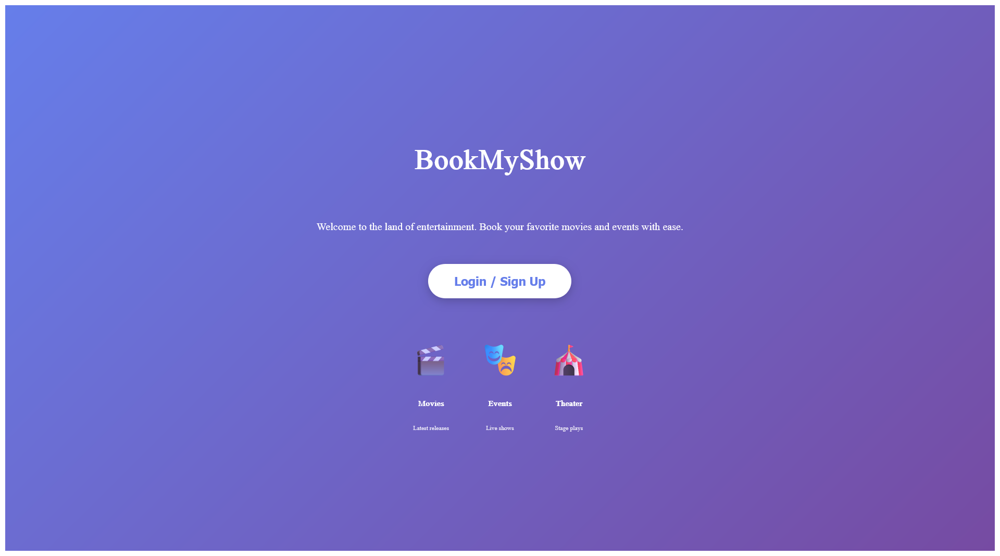
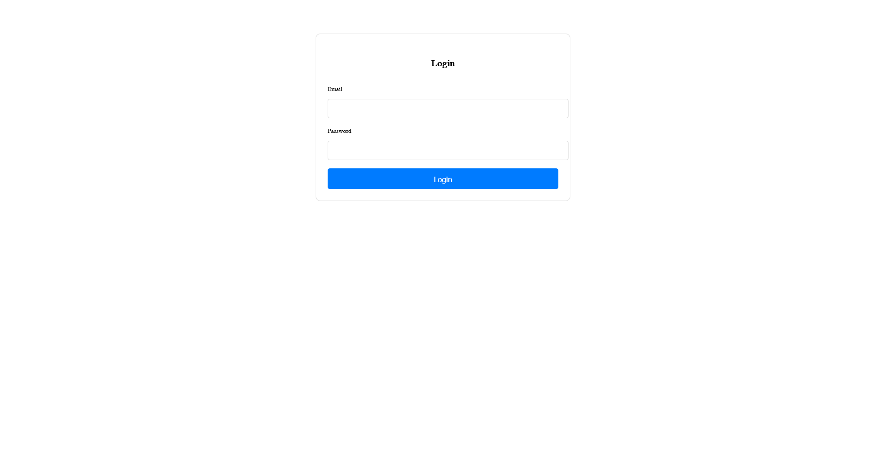
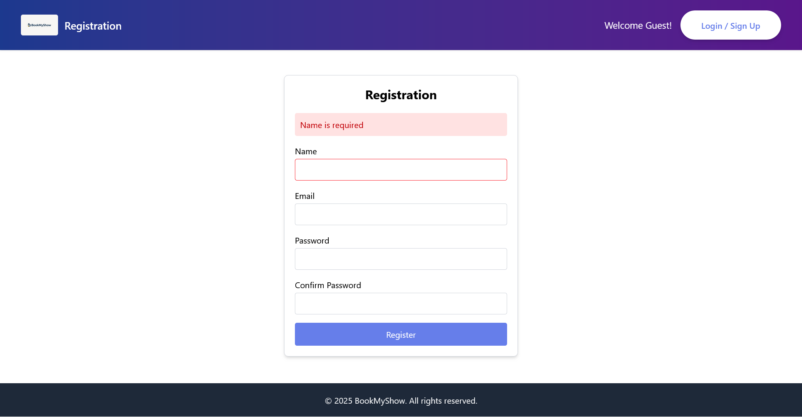
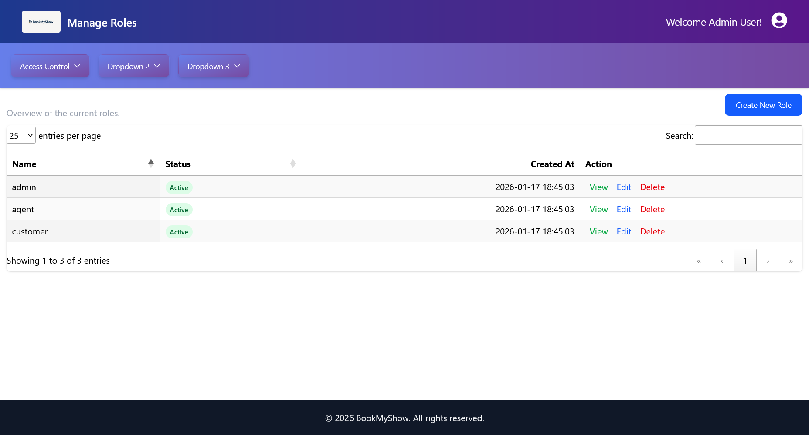
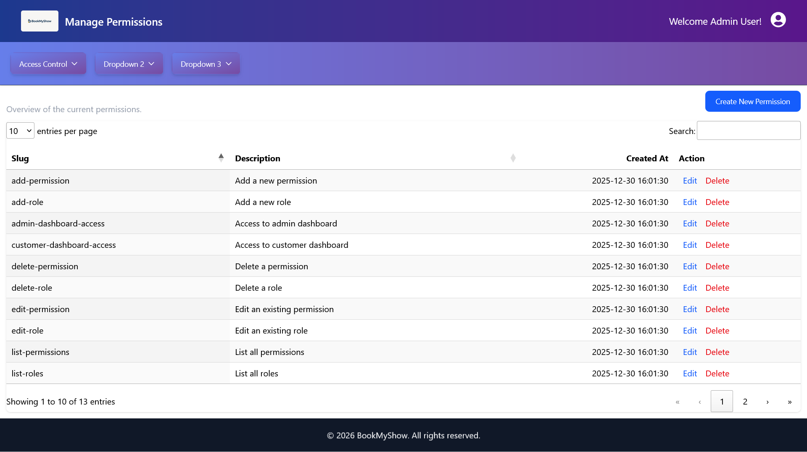

# BookMyShow

## About Project

This project is Laravel framework based which uses Vite + Reactjs for UI & MySql for RDBMS.

It facilitates the admins to create events and schedule it venue, date and time, while customers can book a ticket for the events and provide rating for the paid events.

## Project Setup

### in Windows wsl or Ubuntu

#### A light-weight command-line interface for interacting with Laravel's default Docker development environment.

To check and remove the existing docker images if any.

`usr1:/BookMyShow$ ./vendor/bin/sail down`

To rebuild docker images via. Laravel sail.

`usr1:/BookMyShow$ ./vendor/bin/sail build --no-cache`

To bring the docker container up.

`usr1:/BookMyShow$ ./vendor/bin/sail up -d`

#### Only need during first time project creation to add Laravel encryption token key.

`usr1:/BookMyShow$ ./vendor/bin/sail php artisan key:generate`

#### Run the migrations to set up your MySQL database

`usr1:/BookMyShow$ ./vendor/bin/sail php artisan migrate`

#### Install Node dependencies inside Docker

`usr1:/BookMyShow$ ./vendor/bin/sail npm install`

#### Start the Vite development server for React

`usr1:/BookMyShow$ ./vendor/bin/sail npm run dev`

### in Windows with Docker Desktop and Minikube

#### Prerequisites

- Docker Desktop must be installed and running
- Minikube must be installed
- kubectl must be installed

#### Navigate to Project Directory

```powershell
cd c:\Users\invsi1\wwwroot\practise\php\BookMyShow
```

#### Start Minikube

```powershell
minikube start
```

#### Initial Deployment

Apply Kubernetes configurations in the following order:

```powershell
# Apply secrets and persistent volumes
kubectl apply -f k8s\secrets.yaml
kubectl apply -f k8s\persistent-volumes.yaml

# Deploy database and services
kubectl apply -f k8s\mysql-deployment.yaml
kubectl apply -f k8s\redis-deployment.yaml
kubectl apply -f k8s\phpmyadmin-deployment.yaml

# Wait for MySQL to be ready
kubectl wait --for=condition=ready pod -l tier=database --timeout=120s

# Deploy the application
kubectl apply -f k8s\deployment.yaml
kubectl apply -f k8s\service.yaml

# Wait for app pod to be ready
kubectl wait --for=condition=ready pod -l tier=frontend --timeout=120s
```

#### Run Database Migrations and Seeders

```powershell
# Get pod name
$podName = kubectl get pods -l tier=frontend -o jsonpath='{.items[0].metadata.name}'

# Run migrations
kubectl exec -it $podName -- php artisan migrate

# Run seeders (safe to run multiple times - won't create duplicates)
kubectl exec -it $podName -- php artisan db:seed

# If you added new migrations after initial setup, run:
kubectl exec -it $podName -- php artisan migrate

# To refresh database (WARNING: deletes all data)
# kubectl exec -it $podName -- php artisan migrate:fresh --seed
```

**Note:** The seeders use `firstOrCreate` and `updateOrCreate` methods, so they're safe to run multiple times without creating duplicate entries.

#### Configure CSRF/CORS for Minikube

Laravel Sanctum needs to know which domains are allowed to make authenticated requests. Update the `.env` file with your Minikube service URLs:

```powershell
# 1. Get your actual Minikube service URL
minikube service bookmyshow-service --url
# Example output: http://192.168.49.2:30080

# 2. Extract the domain:port (e.g., 192.168.49.2:30080)

# 3. Copy .env file from pod to local
kubectl cp ${podName}:/var/www/html/.env .env.local

# 4. Edit .env file and add/update SANCTUM_STATEFUL_DOMAINS
# Add your Minikube IP and port to the list:
# SANCTUM_STATEFUL_DOMAINS=localhost,localhost:5173,127.0.0.1,192.168.49.2:30080

# 5. Copy updated .env back to pod
kubectl cp .env.local ${podName}:/var/www/html/.env

# 6. Restart the deployment to apply changes
kubectl rollout restart deployment bookmyshow-app

# 7. Clean up local copy
Remove-Item .env.local
```

**Why this is needed:**
- Sanctum uses cookie-based authentication for SPAs (Single Page Applications)
- CSRF protection requires the frontend domain to be in the stateful domains list
- Minikube assigns dynamic IPs (like `192.168.49.2`) with NodePort services
- Without this configuration, you'll get CSRF token mismatch errors

**What SANCTUM_STATEFUL_DOMAINS does:**
- Tells Laravel which domains should receive stateful API authentication cookies
- Enables CSRF cookie-based protection for requests from these domains
- Must include: localhost (dev), Vite port (5173), and your Minikube service URL

#### Troubleshooting: Image Pull Issues

If you encounter image pull errors, build the Docker image using Minikube's Docker daemon:

```powershell
# Configure PowerShell to use Minikube's Docker daemon
minikube -p minikube docker-env --shell powershell | Invoke-Expression

# Build the Docker image
docker build -t sail-8.5/app:latest .

# Verify the image was built
docker images | Select-String "sail-8.5"

# Delete existing pod to force fresh start
kubectl delete pod -l tier=frontend

# Wait for new pod to be ready
kubectl wait --for=condition=ready pod -l tier=frontend --timeout=120s

# Get the new pod name and run migrations
$podName = kubectl get pods -l tier=frontend -o jsonpath='{.items[0].metadata.name}'
kubectl exec -it $podName -- php artisan migrate
kubectl exec -it $podName -- php artisan db:seed
```

#### Install Node Dependencies and Start Vite Dev Server

Node dependencies are automatically installed via init container when the pod starts. You only need to start the Vite dev server:

```powershell
# Get pod name
$podName = kubectl get pods -l tier=frontend -o jsonpath='{.items[0].metadata.name}'

# Start Vite dev server (runs in background inside pod)
kubectl exec -it $podName -- npm run dev -- --host 0.0.0.0
```

#### Fixing CORS Issues (if encountered)

If you encounter CORS errors when accessing the application locally:

```powershell
# Port-forward Vite dev server in background
Start-Job -ScriptBlock { kubectl port-forward $using:podName 5173:5173 }

# Check job status
Get-Job

# Copy updated Vite config to pod
kubectl cp vite.config.js ${podName}:/var/www/html/vite.config.js

# Restart Vite dev server
kubectl exec -it $podName -- npm run dev -- --host 0.0.0.0
```

To stop background jobs:

```powershell
# Stop all jobs
Get-Job | Stop-Job
Get-Job | Remove-Job
```

#### Build Production Assets

```powershell
kubectl exec -it $podName -- npm run build
```

#### Access the Application

Get the Minikube service URLs:

```powershell
# Get URLs only
minikube service bookmyshow-service --url
minikube service phpmyadmin-service --url

# Or open in browser automatically
minikube service bookmyshow-service
minikube service phpmyadmin-service
```

#### Monitoring and Debugging

```powershell
# View all resources
kubectl get all

# Check all pods status
kubectl get pods

# Check pods with detailed information
kubectl get pods -o wide

# View application logs (follow mode)
kubectl logs -l tier=frontend -f

# Get Minikube IP address
minikube ip
```

#### Restart and Cleanup Commands

```powershell
# Force restart deployment
kubectl rollout restart deployment bookmyshow-app

# Clean up all resources
kubectl delete -f k8s\service.yaml
kubectl delete -f k8s\deployment.yaml
kubectl delete -f k8s\phpmyadmin-deployment.yaml
kubectl delete -f k8s\redis-deployment.yaml
kubectl delete -f k8s\mysql-deployment.yaml
kubectl delete -f k8s\persistent-volumes.yaml
kubectl delete -f k8s\secrets.yaml

# Stop Minikube
minikube stop

# Delete Minikube cluster (complete reset)
minikube delete
```

#### Rebuilding After Minikube Restart

```powershell
# Start Minikube
minikube start

# Configure Docker daemon
minikube -p minikube docker-env --shell powershell | Invoke-Expression

# Verify image exists (rebuild if needed)
docker images | Select-String "sail-8.5"
```

#### Development Workflow - Syncing Local Changes to Pods

**Important:** Kubernetes pods run containerized applications with isolated filesystems. Local code changes don't automatically reflect in running pods because:
- The Docker image contains code from build time
- Pods use their own filesystem, separate from your local machine
- There's no automatic sync between local files and pod files

**Development Options:**

**Option A: Manual File Copy (Quick Changes)**
```powershell
# Get pod name
$podName = kubectl get pods -l tier=frontend -o jsonpath='{.items[0].metadata.name}'

# Copy single file
kubectl cp "path/to/file.jsx" "${podName}:/var/www/html/path/to/file.jsx"

# Copy entire directory
kubectl cp "resources/js" "${podName}:/var/www/html/resources/js"

# For React changes, Vite will auto-reload if dev server is running
# For PHP changes, no restart needed (Laravel auto-loads)
```

**Option B: Rebuild Image (Production-like Testing)**
```powershell
# 1. Configure Minikube Docker environment
minikube -p minikube docker-env --shell powershell | Invoke-Expression

# 2. Rebuild image with changes
docker build -t sail-8.5/app:latest .

# 3. Delete pod to force image pull
kubectl delete pod -l tier=frontend

# 4. Wait for new pod
kubectl wait --for=condition=ready pod -l tier=frontend --timeout=120s

# 5. Restart Vite dev server (see Daily Startup Commands)
```

**Option C: Use WSL/Linux (Recommended for Heavy Development)**
For active development with frequent changes, consider using WSL or Linux where you can use:
- Docker volumes for live code sync
- Laravel Sail for seamless local development
- Faster file I/O and better Docker integration

**Best Practice:**
- Use **Option A** for quick UI tweaks and testing
- Use **Option B** before committing code or testing production builds
- Use **Option C** for day-to-day development work

#### Daily Startup Commands (After Minikube Restart)

After restarting your computer or minikube, run these commands to get everything running:

```powershell
# 1. Start Minikube
minikube start

# 2. Verify all deployments exist (apply if needed)
kubectl get deployments
# If deployments don't exist, run the Initial Deployment section above

# 3. Wait for all pods to be ready
kubectl wait --for=condition=ready pod -l tier=database --timeout=120s
kubectl wait --for=condition=ready pod -l tier=frontend --timeout=120s

# 4. Check all pods status
kubectl get pods -o wide

# 5. Get the application pod name
$podName = kubectl get pods -l tier=frontend -o jsonpath='{.items[0].metadata.name}'

# 6. Check if npm dependencies exist (handle "vite not found" error)
$viteCheck = kubectl exec $podName -- test -f node_modules/.bin/vite; $?
if (-not $viteCheck) {
    Write-Host "`nInstalling npm dependencies (vite not found)..." -ForegroundColor Yellow
    kubectl exec -it $podName -- npm install
}

# 7. Start Vite dev server in background
Write-Host "`nStarting Vite dev server..." -ForegroundColor Green
Start-Job -Name "vite-dev" -ScriptBlock { 
    kubectl exec -it $using:podName -- npm run dev -- --host 0.0.0.0 
}

# 8. Port-forward Vite dev server in background (required for CORS)
Write-Host "Setting up port-forward for Vite (CORS fix)..." -ForegroundColor Green
Start-Job -Name "port-5173" -ScriptBlock { 
    kubectl port-forward $using:podName 5173:5173 
}

# 9. Wait a moment for jobs to start
Start-Sleep -Seconds 3

# 10. Check background jobs status
Write-Host "`nBackground Jobs Status:" -ForegroundColor Cyan
Get-Job

# 11. Get application URLs
Write-Host "`nApplication URLs:" -ForegroundColor Green
Write-Host "BookMyShow: " -NoNewline
$appUrl = minikube service bookmyshow-service --url
Write-Host $appUrl
Write-Host "phpMyAdmin: " -NoNewline
minikube service phpmyadmin-service --url
Write-Host "Vite Dev Server (via port-forward): http://localhost:5173" -ForegroundColor Green

Write-Host "`nNote: Access the application through the BookMyShow URL above." -ForegroundColor Yellow
Write-Host "The Vite dev server runs on port 5173 for hot-reload functionality." -ForegroundColor Yellow

# 12. Verify SANCTUM_STATEFUL_DOMAINS includes Minikube URL
Write-Host "`nChecking SANCTUM_STATEFUL_DOMAINS configuration..." -ForegroundColor Cyan
$minikubeDomain = $appUrl -replace 'http://', '' -replace 'https://', ''
$currentDomains = kubectl exec $podName -- grep SANCTUM_STATEFUL_DOMAINS /var/www/html/.env
if ($currentDomains -notlike "*$minikubeDomain*") {
    Write-Host "WARNING: $minikubeDomain not found in SANCTUM_STATEFUL_DOMAINS!" -ForegroundColor Red
    Write-Host "You may encounter CSRF errors. Update .env file with:" -ForegroundColor Yellow
    Write-Host "SANCTUM_STATEFUL_DOMAINS=localhost,localhost:5173,127.0.0.1,$minikubeDomain" -ForegroundColor Yellow
} else {
    Write-Host "SANCTUM_STATEFUL_DOMAINS configured correctly!" -ForegroundColor Green
}
```

Common issues and fixes:

```powershell
# If you encounter CSRF token mismatch errors:
# Get your Minikube service URL
$appUrl = minikube service bookmyshow-service --url
$domain = $appUrl -replace 'http://', ''

# Update SANCTUM_STATEFUL_DOMAINS in the pod
kubectl exec -it $podName -- sed -i "s|SANCTUM_STATEFUL_DOMAINS=.*|SANCTUM_STATEFUL_DOMAINS=localhost,localhost:5173,127.0.0.1,$domain|g" /var/www/html/.env
kubectl rollout restart deployment bookmyshow-app

# If Vite still shows CORS errors after startup:
kubectl cp vite.config.js ${podName}:/var/www/html/vite.config.js
kubectl exec -it $podName -- pkill -f vite  # Kill existing vite process
# Then restart the vite-dev job

# If pods are not starting:
kubectl describe pod $podName  # Check for errors
kubectl logs $podName -f  # View logs

# If image is missing:
minikube -p minikube docker-env --shell powershell | Invoke-Expression
docker images | Select-String "sail-8.5"
# If not found, rebuild: docker build -t sail-8.5/app:latest .
```

#### Quick Sync Helper Script

Save this as `sync-to-pod.ps1` for easier development:

```powershell
# sync-to-pod.ps1 - Sync local changes to Kubernetes pod
param(
    [string]$FilePath = "",
    [switch]$AllJS,
    [switch]$AllPHP
)

$podName = kubectl get pods -l tier=frontend -o jsonpath='{.items[0].metadata.name}'
Write-Host "Using pod: $podName" -ForegroundColor Cyan

if ($FilePath) {
    # Sync specific file
    $relativePath = $FilePath -replace '^.*\\BookMyShow\\', ''
    $remotePath = "/var/www/html/$($relativePath -replace '\\', '/')"
    kubectl cp $FilePath "${podName}:${remotePath}"
    Write-Host "Synced: $FilePath" -ForegroundColor Green
}
elseif ($AllJS) {
    # Sync all JS/JSX files
    kubectl cp "resources/js" "${podName}:/var/www/html/resources/js"
    Write-Host "Synced all JS files" -ForegroundColor Green
}
elseif ($AllPHP) {
    # Sync PHP files
    kubectl cp "app" "${podName}:/var/www/html/app"
    kubectl cp "routes" "${podName}:/var/www/html/routes"
    Write-Host "Synced PHP files" -ForegroundColor Green
}
else {
    Write-Host "Usage:" -ForegroundColor Yellow
    Write-Host "  .\sync-to-pod.ps1 -FilePath 'path\to\file.jsx'"
    Write-Host "  .\sync-to-pod.ps1 -AllJS"
    Write-Host "  .\sync-to-pod.ps1 -AllPHP"
}
```

Usage examples:
```powershell
# Sync single file
.\sync-to-pod.ps1 -FilePath "resources\js\pages\admin\ViewRoles.jsx"

# Sync all React components
.\sync-to-pod.ps1 -AllJS

# Sync all PHP code
.\sync-to-pod.ps1 -AllPHP
```

To view job output or stop jobs:

```powershell
# View job output
Receive-Job -Name "vite-dev"
Receive-Job -Name "port-5173"

# Stop all background jobs
Get-Job | Stop-Job
Get-Job | Remove-Job
```

## Screenshots

### Home Page



### Login Page



### User Registration Page



### Admin Dashboard


### Manage Roles



### Manage Permissions



## API Document

[Swagger YAML](./public/BookMyShow.swagger.yaml)

## License

The Laravel framework is open-sourced software licensed under the [MIT license](https://opensource.org/licenses/MIT).
